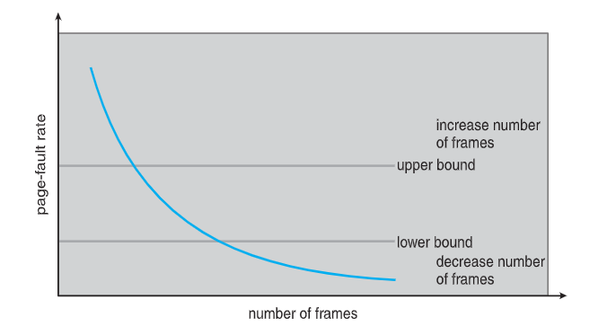
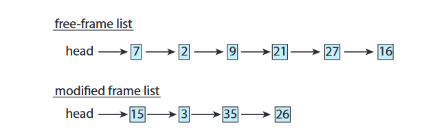
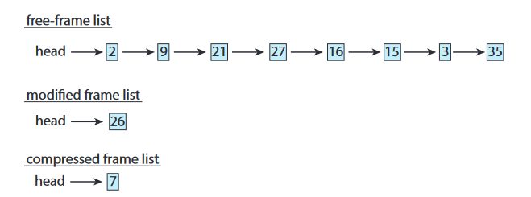

---

## Background

Code需要被放在memory中等待執行，但整個program卻很少被使用到。
+ Error code
+ unusual routines, large data structures

Consider ability to execute partially-loaded program
+ Program不會受到實體記憶體限制，因為使用者可以自己寫一個更大的virtual address space來存放
+ 每個program花費更少的記憶體 -> 同時間有更多program可以執行
+ less I/O needed to load or swap programs into memory -> each user program runs faster

## Virtual Memory

Separation of user logical memory from physical memory

+ 是一種可以讓process執行時，不用完全都在memory中，只需要部份的process
+ Allowing easier programming and larger name space
+ Logical address space can therefore be much larger than physical space
+ Allows address spaces to be shared by several processe
+ Allows for more efficient process creation
+ More programs running concurrently
+ Less I/O needed to load or swap processes

`Virtual address space` :  logical view of how process is stored in memory
`Virtual address` : address generated by CPU , must be translated to physical address later before it used 

+ 通常從0開始，且是連續的address直到空間盡頭
	+ MMU負責maping logical to physical
+ Physical memory organized in page frames
+ 可以透過`demand paging`或`demand segmentation`來實作

### Virtual-address Space

設計上通常會讓stack從`max logical address` grow `down`，而heap則是grow `up` 
+ 在stack跟heap之間的就是`hole` ，也是`sparse address space`
	+ 可以留有空間供stack跟heap成長
	+ 或者將這個區塊用來放DLLs
+ 最大化空間使用 ->  因為中間都只會有一個hole，不會造成external fragmentation
+ 只有當stack或heap變大的時候，才會再要physical memory

### Demand Paging

只將需要的部分載入記憶體中，而不是整個program

+ Basic Concepts
	+ 因為在run time的時候有些page在memory中，有些在secondary storage中
		+ 利用valid bit來判別
			+ valid -> 表示page legal且在memory中
			+ invlid -> 表示page在secondary storage中

+ Access到invalid page時
	+ 造成page fault
	+ Page Fault Handling
		1. 先check process 的 internal table ，來決定這個reference是不是valid access
		2. 不是 -> abort , 是但不在記憶體中 -> step3
		3. 從free frame list中找到free frame
		4. 從secondary storage讀取該page並分配給剛剛找的frame
		5. 當operation完成，修改internal table，page table，來表示該page已經在memory中
		6. 重啟剛剛被trap打斷的instruction，就可以存取到page

+ Aspect
	+ Extreme case
		+ no page in memory
			+ page fault everytime until no fault -> bad performance
		 + 根據理論研究不太可能發生，因為program通常有locality of reference(記憶體附近的空間通常很快會被存取)

+ Hardware Support
	+ Page table with valid bit
	+ Secondary storage
	+ Instruction restart!!!!!

### Free-Frame List

一個存放free frame位置的list
+ OS allocate free frame using `zero-fill-on-demand`
	+ 在frame被分配以前，保持frame的內容清空
	+ When OS startup ，all availale memory is placed on free frame list

#### Demand Paging Optimization

+ Overall use of Swap space
	+ I/O to swap is faster than that to file system
+ Copy entire process image to swap space
	+ Then page in and out of swap
+ Demand page in from program binary on disk, but discard rather than paging out when freeing frame(p19)!!!
	+ anonymous memory
	+ modified in memory but not yet written back to file system

### Copy-on-Write

允許parent跟child可以share same page in memory

+ 當child要修改page C時，OS會去要一個free frame而且copy一份page C的內容讓child修改
![[Copy_on_write_example.png]]

+ vfork

### Page Replacement

Prevent over-allocationof memory by modifying page-fault service routine to include page replacement
+ modify(dirty) bit
	+ only modified page are written to disk
+ Page replacement comple  separation
	+ large virtual memory can be provided on a smaller physical memory

#### Basic Page Replacement

1. 在disk中找到想要的page位置
2. 找freeframe
	+ 如果有，就用該freeframe
	+ 沒有，利用replacement algorithm 挑選victim並替換，再將victim frame寫回disk(如果modified(dirty)) 
3. 將page分配到freeframe，更新page table and frame table
4. Continue process，藉由重啟instruction

+ Replacement algorithm
	+ Frame-allocation determines
		+ 一個process需要多少frame
		+ 哪個frame要被替換
	+ Page-replacement algorithm
		+ 要能有最低的page-fault rate
+ Evaluate
	+ 給定一個string ，計算page fault
	+ 字串只包含pagenumber

##### First-In-First-Out Algorithm

+ Belady's anomaly
	+ For some page-replacement algorithm , the page-fault rate may increase as `the number of allocated frames increases`

##### Optimal

+ Replace page that will not be used for longest period of time
+ Used to measure how well your algorithm performaed 

##### LRU

+ Replace page that has not been used in the most amount of time
+ Implementation
	+ Two approach
		+ Counter
			+ Every page with a counter , when referenced , copy the clock into the counter
			+ When a page need to be changed, look at the counters to find smallest value
		+ Stack
			+ 用stack來看page的最近使用時間，在stack中越上方的page代表最近較常被使用
			+ 當page被reference時，將該page從stack中移除，再放到stack的最上方
			+ No need to search
			+ six pointer , cost heavily

+ LRU and OPT are cases ofstack algorithms thatdon’t have Belady’s Anomaly

##### LRU Approximation Algorithms
PPT 31

##### Enhanced Second-Chance Algorithm

+ 同時使用referenece bit 及 modify bit
	+ (0, 0) neither recently used not modified – best page to replace
	+  (0, 1) not recently used but modified – not quite as good, must write out before replacement
	+ (1, 0) recently used but clean – probably will be used again soon
	+ (1, 1) recently used and modified – probably will be used again soon and need to write out before replacement

##### Counting Algorithms
+ Lease Frequently Used(LFU)
+ Most Frequently Used(MFU)

##### Page-Buffering Algorithms

將desired page先分配給一個free frame(藉由free frame list)，直接載入記憶體中，不用等待victim frame寫回storage，當victim frame成功寫回storage後，再將該frame加到free frame list

##### Applications and Page Replacement
p35

#### Allocation of Frames

+ 每一個process需要最少數量的frame
+ 最大frame數量就是total frame數量
+ Two approach
	+ Fixed Allocation
		+ Equal Allocation
		+ Propotional allocation
	+ Priority Allocation
		+ 依照program所需的大小來分配剩餘free frame

##### Global vs Local Allocation

+ Global replacement
	+ process可以從所有的frame裡面挑一個要替換的frame，即使該frame已經被其他process使用
	+ 可能會造成process執行時間相差非常大
	+ 同常能帶來更好的throughput，所以較被廣泛採用
+ Local replacement
	+ process只能從自己被分配到的frame中選擇替換
	+ process間的表現更一致
	+ 但可能造成記憶體效力低落

##### Reclaiming Pages

替free memory設定臨界值，當free memory小於最小臨界值時，就從frame中釋放一些資源，使得隨時有足夠的free frame可供使用。

##### Non-Uniform Memory Access

+ The speed of access to memory by CPU varies
+ 藉由分配給離CPU較近的memory，讓CPU能夠更快存取到記憶體
+ Linux CFS scheduler
+ Solaries lgroups(Locality groups)
	+ 原文書419
	+ 
### Thrashing

+ Definition : a process is busy swapping pages in and out
+ 一個process如果沒有足夠的page，則很容易page fault
	1. page fault
	2. 替換frame
	3. 因為常被使用所以需要把frame再換回來

	+ 低CPU使用率
	+ 造成OS認為需要提高mutiprogramming的程度
		+ 又有process被加入系統 -> thrashing

+ 解決辦法
	+ 利用locality model來觀察程式所需要的frame，盡量避免page fault

#### Working-Set Model

用來觀測程式的locality

+ Δ， Working-set window
	+ too small, cannot emcompass all locality
	+ too large, may overlap many locality
+ working set
+ D working set size
+ m total number of avaliable frame
+ D > m
	+ cause thrashing, because some process will not have enough frames to use
+ How OS use
	+ 依照working set model 分配給process所需的frame
	+ 若分配完後還有額外的frame -> 可以再開新process
	+ 若是working set size增加且超過total number of avaliable frame，則選擇process停掉，來釋放frame，讓其他process使用

#### Page fault frequency

比起working-set model 來說更加直覺
+ 藉由觀察process的page fault rate
	+ page fault rate too high -> increase number of pages
	+ page fault rate too low -> decrease number of pages

### Memory Compression

除了利用swap來解決page的問題之外，memory compression也是另外一種方式。

+ 將modified frame中的15、3、35壓縮成一個frame
+ 將這個frame存在`compressed frame list`中，並讓15、3、35回到free frame list
+ 當這15、3、35之後再被referenced到的時候，再將frame 7解壓縮

### Allocating Kernel Memory

跟user mode不同，記憶體通常從`free-memory pool`而來
主要有兩個原因:

1. 因為kernel可能會去要求分配不同資料結構大小的記憶體，而這些記憶體有的比一個page還小，所以kernel必須要小心地使用記憶體，盡量避免fragmentation造成的浪費。
2. user-mode process通常不需要被分配連續的實體記憶體空間，但有些特定的硬體會直接跟physical address互動，所以可能需要保留一些實體的連續記憶體空間供使用。

通常有兩種方式:

1. Buddy system
	+ 從一段固定大小的實體記憶體中(segment)，利用`powef-of-2 allocator`來分配記憶體，如果要求的記憶體數量不剛好，則提升到下一個2的次方數。
	+ example
		+ 假設有一段實體記憶體大小256KB，而kernel要求了21KB，所以最小的記憶體單位會是32KB，而一開始這個256KB的記憶體會被分成兩個buddies(each with 128KB)，其中一個buddy再被往下分，直到32KB出現。如下圖，最終CL,或CR其中一個則會被分配給kernel的需求。
		![Myimage][../image/buddy.png]
	+ pros
		+ coalescing : 可以快速的將較少使用到的chunk和成一個更大的記憶體空間
	+ cons
		+ fragmentation
2. Slab
	+ slab是由一個或多個連續的記憶體空間組成，而cache是由一個或多個slab組成。
	+ Each cache filled with `objects` – instantiations of the data structure
	+  cache建立時，object被marked `free`
	+ 當sturcutre被儲存時，object被視為used
	+ 如果當前的slab已經都被使用了(marked used)，則下一次的分配再去尋找empty slab
	+ If no empty slabs , new slabs created
	+ pros
		+ no fragmentation
		+ fast memory request satisfaction
			+ 因為allocate 、 deallocate這些動作都相當耗時，slab中有先分配好可以讓記憶體存取的速度更快速。

