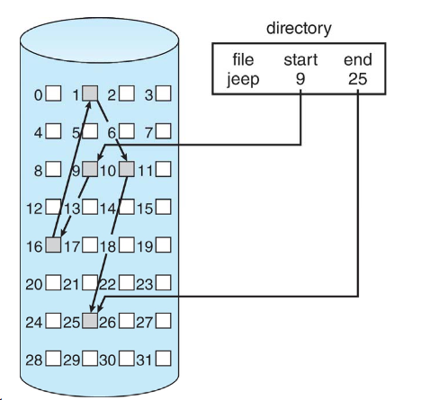
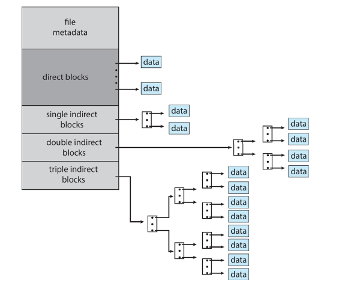

---

## File-System Structure

+ 磁碟提供in-place 存取
	+ I/O transfers performed in blocks of sector(usually 512byes)
+ File control block (FCB)
	+ 提供檔案的相關資訊	
+ Device driver
	+ 控制實體裝置

## File System Layers

由上到下依序為
+ application programs
+ logical file system
	+ 將檔名轉換成file number
	+ manage metadata information
	+ manage directory management and protection
	+ main tain FCB (在Unix 中是 inode)
+ file-organization module
	+ 將logical block 轉換成 physical block
+ basic file system
	+ 管理記憶體buffer(hodling data in transit), cache(allocation, freeing , replacement)
	+ 將命令傳給device driver
+ I/O control
	+ device driver在這一層負責處理裝置的I/O
+ devices

## File-System Operations

+ Boot control block
	+ 包含啟動OS所需的的資訊
+ Volume control block(superblock master file table)
	+ 包含volume的詳細資訊
		+ total blocks數輛
		+ free block數量
		+ block size
+ File Control Block (FCB)
	+ 包含檔案相關的細節
		+ inode number, permission, size ,date

## In-Memory File system Structures

PPT 7
+ Mount table 
	+ 儲存了檔案系統mount、mount point 、file system type...
+ System-wide open-file table
	+ 包含了每個檔案的FCB及其他資訊
+ per-process open-file table
	+ 包含pointer指向在system-wide-open-file中適當的位置

## Directory Implementation

+ Linear list
	+ 易於撰寫
	+ 執行相當耗時
+ Hahs Table
	+ 減少搜尋時間
	+ 當兩個檔案hash到同一個location時，會造成collision
	+ 只有當entries是固定的時候才比較方便

## Allocation Methods

定義disk blocks是怎麼被分配給檔案的

+ Contiguous allocation
	+ 檔案占用連續的空間
	+ Simple
	+ 可能問題
		+ finding space for file
		+ knowing file size
		+ externel fragmentation
		+ compaction off-line or on-line
	+ Extent-based system
		+ 當檔案空間不足的時候額外添加chunk(called extent ，也就是一段連續的記憶體空間)
		+ 會記錄新extent的first block，用來讀取時可以找到位置
		+ 問題
			+ 給的空間太大會造成internal fragmentation
			+ 配置空間、釋放空間因為大小不一會造成external fragmentation
		

+ Linked allocation
	+ Each file is a linked list of blocks
	+ blocks可能在磁碟的任何地方
	+ 每個block都有一個pointer指向下一個block，當指到nil pointer時，即表示檔案結尾
	+ 優點
		+ 不會造成external fragmentation
	+ 缺點
		+ 會需要有空間用來儲存pointer
		+ 定位一個block需要許多I/O
		+ Reliablity低，因為若其中一個block的pointer丟失，則檔案損毀
			+ 可以利用cluster解決，但會造成internal fragmentation
	+ FAT(File Allocation Table)
		+ 在一個table中儲存所有links
		+ 藉由讀取FAT來找block位置
	

+ Indexed allocation
	+ 每一個檔案都有各自的index block
	+ 當從directory來取得檔案時，會給檔案的index block
	+ 藉由查找index block，來找到儲存該檔案的各個block
	+ 當檔案很大，單一個index block可能不夠用時
		+ Linke scheme
			+ 利用這個scheme將index block連接在一起
			+ 每個index block會有指向下一個index block的指標
		+ Mutilevel index
			+ 利用多層的index block來找到該檔案所屬的index block
		+ Combined Scheme
			+ UNIX UFS
				+ linux 中的inode
				+ 包含direct blocks -> 直接指向存取data的block
				+ single indirect -> 指向存放data block的address
				+ seond indirect -> 同上，但有兩層indirect
				+ 可以有更多block被存取，相較於直接利用32-bit file pointer

## Performance 

根據不同的檔案存取類型有不同的策略

+ Contiguous 適合連續且隨機存取
+ Linked適合連續、非隨機存取
+ Index 
	+ 利用Cluster可以幫助提升throughput

## Free-Space Management

檔案系統會維護一個free-space list來追蹤free block/clusters

+ Bit vector or bit map
	+ bit vector中每一個位置個別對應到一個block
	+ bit為0表示block被分配 , 1表示block未被分配
+ Linked
	+ 將所有的free block用linked list串在一起
	+ 第一個block的block number被額外儲存在disk中或cache中
	+ 當系統要free block時，需要走訪整個list
	+ 取的連續記憶體不易
	+ 可藉由以下兩種方式做改善
		+ Grouping
			+ 在第一個first free block中，儲存n個free block的位置
			+ 在n個free block中再儲存下n個free block的位置
		+ Counting
			+ 儲存first block的位置及n，n代表的是first block往後n個block的連續空間
			+ 再這個list中，每一個entry會包含以下資訊
				+ first block的位置
				+ n
+ Space map
	+ ppt 20

## TRIMing Unused Block

+ 當磁碟空間滿了，需要進行垃圾會收及block erase to collect unused block
	+ 造成storage的write效率下降 -> 因為storage需要去做erase
+ 需要有一個機制在磁碟滿了以前告訴FS去將unused block清空

## Efficiency and Performance

+ Efficiency dependent on
	+ disk allocation , directory algorithm
	+ types of data
+ Performance
	+ Buffer cache - 主記憶體中分開的部分，用來存放常用的block
	+ Synchronous 
		+ PPT 22
	+ Free-behind and read-ahead
		+ 用來優化存取的技術

## I/O Without a Unified Buffer Cache

+ page cache
	+ 利用virtual memory及address
+ Not unified cache
	+ 主記憶體利用page cache
	+ 其他I/O利用buffer cache

## I/O Without a Unified Buffer Cache

利用同一個page cache來避免double caching

## Recovery

+ Consistency checking
	+ 檢查檔案一致性
+ 備份檔案

## Log Structured File Systems

+ 紀錄所有改動
+ Transaction in the log are asynchronously written to the file system
+ 當檔案系統損毀，all remaining transactions in the log msut be performed
+ 可以快速復原檔案

## WAFL File System

+ 隨機寫入
	+ 不會覆蓋現有data ，而是將data寫到disk中的free block
+ snapshot
	+ 用於備份