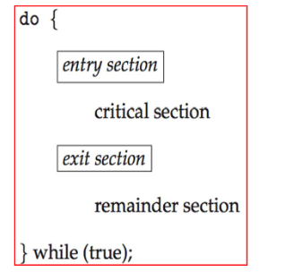

---
date 2023-05-13 23:35
alias : []
---

---

## Race Condition

`race condition: 當許多process在運作時，而且存取到相同的資料時，執行結果會依賴於存取發生的時間點。`

## The Critical Section Problem

`Entry section: 用來確認是否可以進入critical section的地方`

通常會是以下架構:

## Requirement for Slution to Critical-Section Problem

1. Mutal Exclusion : 當有一個process正在執行`critical section`的時候，其他的process不能夠執行他們的critical process
2. Progress : 當目前沒有process在執行他們的critical section，而且有些process想要進入他們的critical section，那這個process的選擇就不能被推遲，需要被盡速決定。
3. Bounded waiting: 對process進入critical section的次數進行限制。

## Critical-Section Handling in OS

Two approaches :
+ `Preemptvie : allows preemption of process when running in kernel mode`
+ `Non-preemptive : 持續運行直到退出kernel mode，遇到block，或是自願讓出CPU資源`
	+ 因為程式會是一次執行完，所以在non-preemptive kernel mode下基本不會有race condition

## Peterson's Solution

是一種在軟體上解決critical-section problem的方法(ppt6.9)

## Hardware Support for Synchronization

+ Uniprocessors - could dissable interrupts
	+ 當前執行的critical code不會被preempted
	+ 對多處理器系統來說太沒效率

+ Memory barriers
+ Hardware instructions
	+ TestAndSet()
	+ CompareAndSwap()
+ Atomic variables
	+ `Do not solve race conditions in aall circumstances`

## Memory Barriers

`memory model : A memory model is a formal specification that describes the behavior of memory in a computer system. The memory model defines the rules for how memory can be accessed and manipulated by different parts of a program running on a computer, including the processor, the operating system, and application programs.`

+ Strongly ordered : 一個processor的記憶體改動`會立即`被其他所有的processor接收到
+ Weakly ordered :  一個processors的記憶體改動`不會立即`被其他所有的processor接收到。

`Memory barrier : 是一個強迫任何記憶體改動會被visible to其他processors的指令`

## Hardware Instruction

+ TestAndSet(ppt 6.13)
+ CompareAndSwap(ppt6.14)

## Mutex Locks

+ OS designers build software tools to solve critical section problem
+ is also called `spinlock`
+ Require `busy waiting`
+ 當一個process需要進入critical section的時候，他就去acquire一個lock，其他process因為沒有拿到lock，就必須等待該process執行完後釋出lock

## Semaphores

是一種synchronization tool，提供更多複雜的(sophisticated)方式來同步process之間的活動。

### Usage

分為兩種
+ Counting semaphore : integer value can range over an unrestricted domain
+ Binary semaphore : interger的值只有0或1
	+ 跟`mutex lock`很相似，但不同的是，`mutex lock`有owner的概念，當process拿到lock後就變成lock的owner，`semaphore則沒有這個概念`

### Implementation

必須確保同時間不會有兩個process對同一個semaphore同時執行wait跟signal。所以wait跟signal的實作就必須被放在`critical sectoin`。

-->`critical section`的實作中會出現`busy waiting`
+ 但implementation code本身很短

然而因為應用程式可能會花很多時間在critical section busy waiting, 所以並不是一個好的解決辦法。

Semphore Implementatioin with no Busy Waiting(ppt21)

### Problems

不正確的使用semaphore函式
+ signal -> wait 先signal，造成semaphore變大，可能導致很多process同時執行他們各自的critical sectoin
+ wait -> wait  ，在`binary semaphore`的狀況下，利用wait得到進入critical section的分配，執行完後卻沒有signal semaphore，導致該seamphore永遠被block住

## Monitors

是一個高階的抽象介面，提供了一些方便且有效的process synchronization機制。
+ only one process may be active within the monitor at a time
+ conditon variable (恐龍本280)

## Liveness

+ Deadlock : process之間互相等待
+ Starvation : 低優先權的process可能會一直拿不到系統資源，留在semaphore list中
+ Priority Inversion : 低優先權process佔住lock，而這個lock正被高優先權process需要
	+ 可被`Priority Inheritance Protocol`解決 