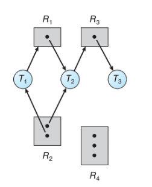
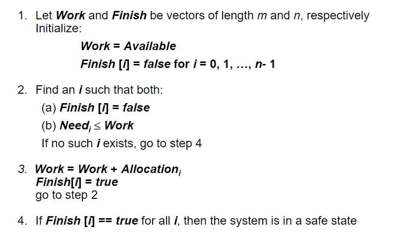
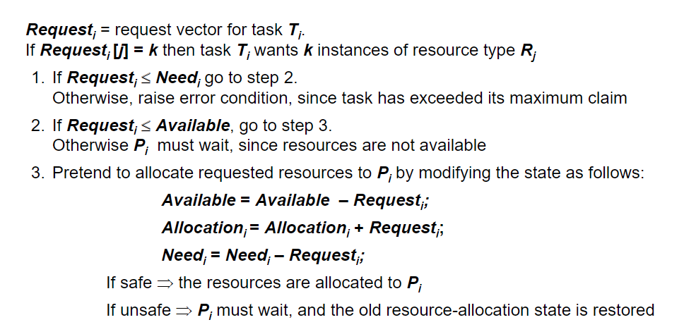

---

## System Model

系統由各種資源所組成CPU cycles, memory space, I/O devices....
每一個process會使用以下三種方式來利用資源
+ Request
+ Use
+ Release

## Deadlock Characterization

deadlock必須滿足以下四個條件才能夠成立，而滿足以下四個條件卻不一定會造成deadlock
+ Mutual exclusion
	+ 一個資源同一時間只能被一個process使用 
+ Hold and wait
	+ 一個process具有resources，且正在等待其他process使用的resources
+ No preemption
	+ resources只能在process完成他的工作後被主動釋出
+ Circular wait

## Resource-Allocation Graph

+ If graph contains no cycles -> no deadlock
+ If graph contains a cycle 
	+ 如果每個資源都只有一種instance ，就會造成deadlock
	+ 如果有多個資源有多個instance,  `有可能`造成deadlock

## Methods for Handling Deadlocks

+ 避免系統進到deadlock狀態
	+ Deadlock prevention
	+ Deadlock avoidance
+ 允許系統進入deadlock狀態，然後再復原
	+ Deadlock detection
	+ Recovery from deadlock
+ 忽略問題且裝作系統沒有發生過deadlock

### Deadlock Prevention

+ 無效化deadlock的四種必要條件
	+ Mutual Exclusion
		+ 共享的資源不需要mutual exclusion，所以不會造成deadlock。ex : `read-only file`
		+ 但有些資源本身必須是mutual exclusion，像是`mutex lock`，因此這個方式通常較難做到。
	+ Hold and wait
		+ 確保某一個process在索要資源時，手上並不具備任何資源
		+ 因為資源使用率低(有些資源被閒置)，可能造成starvation
	+ No Preemption
		+ 當一個process沒有辦法立即拿到想要的資源時，就將手上的資源全部釋放，而這些資源就是`preempted resources`
		+ preempted resources會被加到list中，而list中的資源都是process正在等待的
		+ 當process拿到舊有資源以及新request的資源時，才會重新開始執行
	+ Circular Wait
		+ 強制指定拿取資源的順序，ex: 有R1,R2，如果需要兩個資源時，只能先拿R1再拿R2，不能先拿R2再拿R1
		+ 是四種方式中最實際的一種
	
### Deadlock Avoidance

+ 需要系統本身有提供額外資訊
	+ 每個process明確要求對每一個resouce type的最大需求數(maxium number)
	+ deadlock-avoidance演算法動態確定資源的分配情況來避免circular-wait

+ Resource-allocation state is defined by 
	+ the number of available and allocatedresources, and 
	+ the maximum demands of the processes

+ 如何在request resource的時候檢查資源分配
	+ Single instance of a resource type
		+ resource allocation diagraph
	+ Multiple instance of a resouce type
		+ Banker's Algorithm
	
#### Safe State

+ System is in `safe state` for each Pi, the resources that Pi can still request can be satisfied by currently available resources + resources held by all the Pj, with j < I

#### Basic Facts

+ 如果系統在safe state -> no deadlocks
+ 如果系統在unsafe state -> 可能deadlock
+ Avoidance -> 確保系統不會進到unsafe state

#### Resource-Allocation Graph Scheme

+ Claim Edge
+ Request Edge
+ Assignment Edge
+ State change from claim to request to assignment , then back to claim
+ Request會被同意只發生在以下情況
	+ 將request edge轉成 assignment edge時，不會形成cycle

#### Banker's Algorithm

+ 當一個thread進入系統時，他必須聲明所需要的資源的最大數量及種類，且不可超出系統所擁有的資源
+ 當user要求資源時，系統會檢查分配以後是否會處於safe state，是則分配，否則不分配
+ 當執行完畢後須將資源歸還給系統

+ DS of Banker's Algorithm
	+ Available
		+ Vector of length m 
	+ Max		
	+ Allocation
	+ Need

#### Safety Algorithm

#### Resource-Request Algorithm for Task Ti

### Deadlock Detection

+ Single Instance of Each Resource Type
	+ Maintain wait-for graph
		+ Nodes are process
		+ Pi -> Pj if Pi is waiting for Pj

	+ 週期性的啟用演算法來檢查graph中是否有cycle
		+ 如果有 -> deadlock(因為每個resource只有一個instance)
		+ 需要n^2個operation
+ Serveral Instance of a Resource Type
	+ ppt27

### Detection-Algorithm Usage

+ Detection-Algorithm要多久呼叫一次取決於
	+ deadlock發生的頻率
		+ 如果呼叫的頻率是隨機的，那可能會因為resource graph中有很多cycle，因而無法辨認是誰造成了deadlock
+  有多少個process會被`rolled back`
	+ one for each disjoint cycle

### Recovery from Deadlock

+ Process termination
	+ Abort all deadlock process
	+ Abort one process at a time until the deadlock cycle is elminated
	+ which order should we choose to abort

+ Resource Preemption
	+ Selecting a victim - minimize cost
	+ Rollback  - return to some safe state , restart process for that state
	+ Starvation - same process may always be picked as victim
