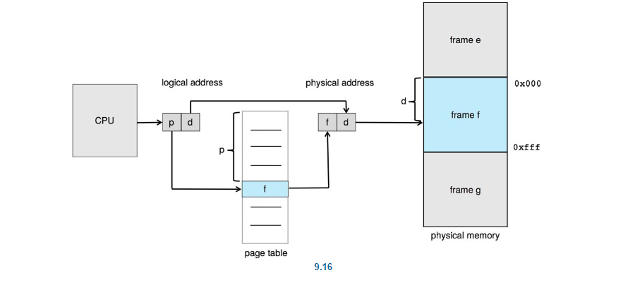
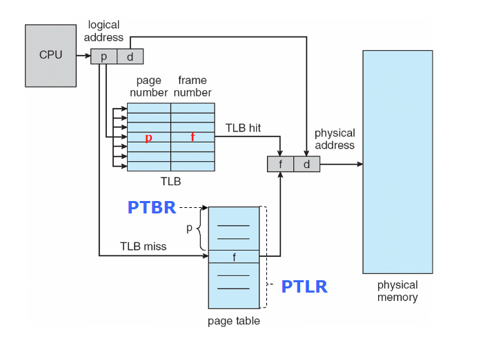

---

## Memory Management

+ Main memory及register是CPU唯一可以直接取用的storage
	+ Main memory的存取可能會花費很多cycle，造成stall
	+ Register的存取通常會在一個CPU clock內完成(or less)
	+ `Cache` 的角色則是位於register及main memory之間
	+ Execution-in-Place(XIP) : 直接執行在Read-only memory中的code，免去了將其loading到RAM中的過程。

+ Memory unit only sees a stream of:
	+ address and read requests, or address + data and write requests

### Protection of Memory

+ 確保process只能存取他自己address space中的資料，利用 :
	+ A pair of base and limit registers to define the logical address space of a process

### Hardware Address Protection

+ CPU必須確定在user mode中的記憶體存取範圍落在base跟limit之間
+ loading base and limit register are privileged

### Binding of Instructions and Data to Memory

+ Address binding of instructions and data to memory addresses can happen at three different stages
	+ Compile time
		+ 如果記憶體位置事先已知，則可以產生`absolute code`，但當位置改變時就需要重新編譯
	+ Load time
		+ 如果記憶體位置依舊未知，則必須產生`relocatable code`
	+ Execution time
		+ 如果process在runtime的memory segment還會變動，則binding有可能到這個階段才發生

1. *absoulte code : 通常指直接在實體記憶體上跑的machine code，這些機器碼預設會在指定的記憶體位置上執行，因此當程式有更動時，就必須重新編譯。*
2. *relocatable code : 也是machine code，然而這個machine code可以被load到記憶體的任一個位置且不需要改動或重新編譯，相對於absolute code較為便利*

### Logical vs. Physical Address Space

The concept of a logical address space that is bound to a separate physical address spaceis central to proper memory management

+ Logical address : 由CPU所產生，也被稱作`virutal address`
+ Physical address : 實體記憶體位置
+ Logical及Physical在complie及loadtime是`相同的`，當到runtime的時候就會變得不同。

#### MMU
在runtime負責將virtual address map到physical address的單位

在MMU中，前面提到的base register現在稱為relocation register，當user process要求某個記憶體位置時，經過MMU後就會加上relocation register中的值來存取到實體記憶體的位置。前面提到的execution time binding就是藉著MMU的方式，只要reference確定了，就可以將logical address mapping到physical address

*reference : 參考的reloction register的位置*

### Dynamic Loading

Routime is not loaded until it is called
+ Program need to be loaded in memory to execute
	+ Better memory-space utilization
	+ Unused routine is never loaded

How 
+ All routines kept on disk in relocatable load format
+ 當有大量的code被需要，然而需要頻率卻不頻繁時，是一個有效的做法。
+ 不需要OS提供特別支援
+ 透過program design實做
+ OS可以提供library來支援dynamic loading

### Dynamic Linking

DLLs(Dynamic linked library),  is system libraries that are linked to user programs when the porgrams are run.

當有user program需要用到DLL的時候loader會找到DLL所在的位置，將其載入記憶體中，再將referenece function中DLL所在位置調整為其在記憶體中的位置。

### Contiguous Memory Allocation

Main memory通常被分為兩部分
+ For OS
	+ interrupt vector通常會被放在低位置
	+ 以前通常放在low memory
	+ 現在放在high memory,  因為這樣就可以cover到所有的記憶體位置
+ For user process
	+ 通常放在high memory

在`contiguous memory allocation`中，每一個process的memory space都是連續的且緊鄰下一個process

為了避免process存取到別人的space，會利用
1. Base register : 紀錄process的memory base
2. Limit register : 紀錄process的memory範圍

### Variable Partition

`hole : block of available memory` , holes of various size are scatterred throughout memory
+ Degree of multiprogramming limited by number of partitions

OS會負責maintain allocated partition以及hole的資訊

### Dynamic Storage-Allocation Problem

First-fit :  allocate第一個夠大的hole
Best-fit : allocate一個最小的hole但又夠讓process能夠使用
Worst-fit : allocate一個最大的hole，而過程也需要找完整個memory

在速度及利用上，first-fit 及 best-fit都優於worst-fit

### Fragmentation

+ External Fragmentation
	+ 記憶體空間滿足需求，但空間不連續
	+ 可用`compaction`解決
		+ 移動memory內容，將所有的free memory變成一個hole
		+ 只有當relocation是dynamic的時候
	+ 可用`Page`解決
+ Internal Fragmentation
	+ 分配的記憶體空間可能會比要求的稍大一點，此大小差異是分區內部的內存，但未被使用。
	+ 假設當前有一個18464bytes的hole，但要求只有18642bytes，如果只分配18642bytes，則會剩下2bytes，而維護這個2bytes的hole就會需要花費成本，因此會決定一個固定size，分配到記憶體中，但這個size不會被使用到。

### Paging

+ Divide physical memory into fixed-sized blocks called `frame`
	+ size is a power of 2 , from 512bytes to 16Mbytes
+ Divide logical memory into fixed-sized blocks called `page`
	+ To run a program of size N pages , need to find N free frames and load program

+ 利用Page table來轉換logical跟physical

### Address Translation Scheme

+ Page number(p) : 哪一個page
+ Page offset(d) : page中的哪一個位置

### Implementation of Page Table

+ Page-table base register (PTBR) 
	+ 指向 page table
+ Page-table length register(PTLR)
	+ 代表page table的大小

+ 每一次執行都需要至少兩次memory access，one for page table, one for data/instruction
	+ Can be solved by Translation look-aside buffers(TLBs) also called `associative memory`

#### TLBs

+ store address-space identifiers(ASIDs)
+ 通常64到1024個entries
+ On TLB miss
	+ loaded to TLB for faster access next time
		+ Replacement policy must be considered
		+ entries can be `wired down` for permanent fast access

+ TLB Hardware
	+ 如果在TLB中找到，就拿對應的frame
	+ 如果找不到，就從page table memory抓

### Effective Access Time

hit rate * access time + miss rate * (access time * 2) 
+ 因為miss的話就要access page table跟 memory，需要兩次

### Memory Protection

+ 在page table中加上valid bit
	+ Valid 
		+ 對應到的page在process的記憶體範圍中
	+ Invalid 
		+ 對應到的page不在記憶體的範圍中

+ page-table length register(PTLR)

#### Shared Pages

+ Shared code
	+ one copy of read-only code shraed among process
	+ useful for Interprocess Communication(IPC)
+ Private code and data
	+ 每個process會有自己的一份code跟data
	+ 這份copy會出現在process的logical address space中

### Structure of the Page Table

如果直接使用單一Page的方式，會造成page table過大。
解決方法
+ Hierarchical Paging
+ Hashed Page Tables
+ Inverted Page Tables

### Two leavel page example(P27)

Known as `forward-mapped page table`

### Hashed Page Table

通常用於32bit以上的系統

將page轉換成hash number，用一個hash table來轉換，hash table包含的內容如下
+ 每一個entry都有一個list，list中的元素包含以下三點
	+ virtual page number
	+ value of the mapped page frame
	+ a pointer to the next element

步驟
1. 將page丟進hash fucntion，得到hash值，
2. 再依照hash值在hash table中從第一個開始尋找，直到找到match的entry
3. 得到entry中page對應的frame

+ Variation for 64-bit is clustered page tables
	+ 跟hash table很像，但每一個entry對應到多個page，而不是一個page
	+ useful for sparse address spaces

*sparse address spaces : 四散在address space中的非連續被拆分開的記憶體*

### Inverted Page Table!!!

1.  In an inverted page table, each entry corresponds to a physical page frame in memory.
2.  Each entry consists of the virtual page number that is mapped to the corresponding physical page frame, as well as information about the process that owns that page.
3.  When a process generates a virtual memory address, the virtual page number is extracted from the address.
4.  The operating system then uses the virtual page number to look up the corresponding physical page frame in the inverted page table.
5.  If the physical page frame is found in the table and belongs to the same process that generated the virtual memory address, then the access is allowed and the process can continue.
6.  If the physical page frame is not found in the table, or if it belongs to a different process, then a page fault occurs.
7.  When a page fault occurs, the operating system checks if there is a free physical page frame available. If so, it selects the free frame and updates the inverted page table to map the virtual page number to the new physical frame.
8.  If there is no free physical page frame available, the operating system selects a victim frame to evict from memory, writes the contents of the frame back to disk if necessary, and updates the inverted page table to map the virtual page number to the new physical frame.
9.  Once the inverted page table has been updated, the process can resume executing at the virtual memory address that caused the page fault.

### Swapping

+ Backing store 
	+ secondary storage 
	+ fast disk large enough to accommodate copies of all memory images for all users; must provide direct access to these memory images
+ Roll out, roll in 
	+ swapping variant used for priority based scheduling algorithms
	+ 低優先權的會被先換出，高優先權會被loaded且執行。
+ swap time的主要時間就是transfertime
	+ 與被swap的記憶體數量有比例性的關係

系統會維護一個ready-to-run process的`ready queue`，which have images on disk

+ 被swap out的process在被swap back時，是否需要相同的physial address?
	+ 取決於binding的形式
	+ Plus consider pending I/O to/from process memory space

#### Context Switch Time including Swapping

要算上swap in/out的時間

+ Pending I/O 不能被swap
	+ 可能導致I/O發生在錯誤的process中 
	+ double buffering

#### Swapping on Mobile Systems

mobile通常不支援swap的原因
+ 通常是flash memory based
	+ 小量的空間
	+ 有限的讀寫次數
	+ 在與main memory之間的throughput低

+ 取代swap的method
	+ IOS
		+ 要求app自己讓出空間
		+ Read-only data thrown out and reloaded from flash if needed
		+ Failure to free can result in termination
	+ Android 
		+ teminate app if low free memory
		+ 但會先將application state寫到flash中，這樣在重啟時可以更快速

#### Swapping with Paging

因為傳統的方式是移動整個process到backing store中，但這樣的成本過高，因此現今系統的方式通常都是利用swapping with paging，只swap process的一部分到backing store